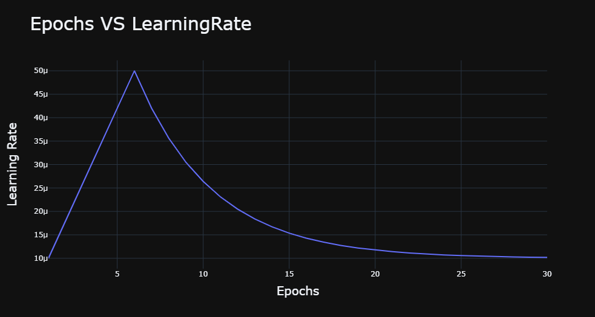

# Fast-Furious-and-Insured-HackerEarth-Machine-Learning-Challenge
# Task:-
* To predict if the Vehicle in the image provided is damaged or not 
* If Vehicle is damaged predict the Insurance Ammount using other provided features like:- Cost of Vehicle, Insurance Company.
# Inspiration
Road traffic accidents claim the lives of about 1.35 million people per year. For children and young adults aged 5 to 29, road traffic accidents are the leading cause of death.Therefore, in most countries, for the sake of safety and protection, the law has made it mandatory for all vehicle owners to have vehicle insurance.

Vehicle insurance safeguards an individual from financial liabilities that might occur as a result of an adverse incident involving your vehicle; such as a car crash, fire, theft, or natural disasters. It covers all medical bills, allowing you to concentrate on getting better rather than worrying about money.


# Dataset Descriptions

* The trainImages folder: Contains 1399 training images
* The testImages folder: Contains 600 testing images
* train.csv: Contains 1399 x 8 data points
* test.csv: Contains 600 x 6 data points
* sample_submission.csv: Contains 5 x 3 data points

The columns in the dataset are as follows:

Column name	Description
* Image_path	Represents the name of an image 
* Insurance_company	Represents masked values of some insurance companies
* Cost_of_vehicle	Represents the cost of a vehicle present in the image
* Min_coverage	Represents the minimum coverage provided by an insurance company
* Expiry_date	Represents the expiry date of the insurance
* Max_coverage	Represents the minimum coverage provided by an insurance company
* Condition	Represents whether a vehicle is damaged
* Amount	Represents the insurance amount of a vehicle
Evaluation metric
# Task 1 To predict if car in the image is damaged or not
I used different Augmentation techniques to create a rich dataset
```
augment=albumentations.Compose([
   albumentations.HorizontalFlip(),
   albumentations.VerticalFlip(),
   albumentations.ShiftScaleRotate(),
   albumentations.HueSaturationValue(hue_shift_limit=10,sat_shift_limit=10,val_shift_limit=10),
   albumentations.RandomBrightnessContrast(),
   albumentations.OneOf([
   albumentations.GaussNoise(),
   albumentations.GaussianBlur(),
   albumentations.MotionBlur()
    ],p=0.3)
```
# Learning Rate Strategy used:-

# Model
Finetunned Densenet-169 with globalaveragepooling2d,dense added on top of densenet model
```
Model=tf.keras.applications.DenseNet169(input_shape=(img_size,img_size,3),include_top=False)
Model.trainable=True
model=tf.keras.models.Sequential([
    Model,
    tf.keras.layers.GlobalAveragePooling2D(),
    tf.keras.layers.Dense(256,activation='relu'),
    tf.keras.layers.Dropout(0.4),
    tf.keras.layers.Dense(1,activation='sigmoid')
])
```
The Model is trained with binary_crossentropy and metrics used are BinaryAccuracy
Evaluation Metric:-
**score1 = max(0, 100*metrics.f1_score(actualConditions, predictedConditions, average="micro"))**

# Task 2 To predict Insurance Ammount
* Normalized the features using StandardScaler.
* Used RandomForestModel with no_of_trees=1000 and max_depth=3
Evaluation Metric:-
**score2 = max(0, 100*metrics.r2_score(actualAmount, predictedAmount))**

# Final Score
final_score=(score1+score2)/2

# Link of Challenge:
**My Above described Solution achieved a final_score=55.84 with rank of 26 among 3000 competitors.**
https://www.hackerearth.com/challenges/competitive/hackerearth-machine-learning-challenge-vehicle-insurance-claim/
